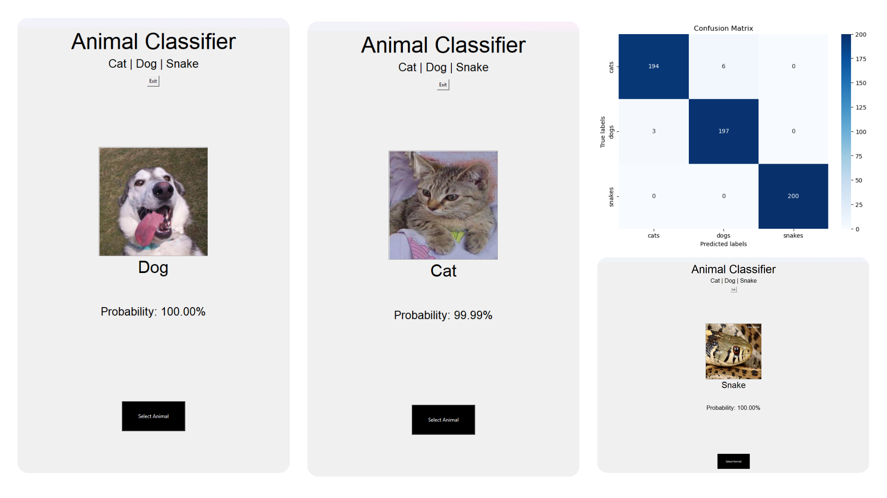
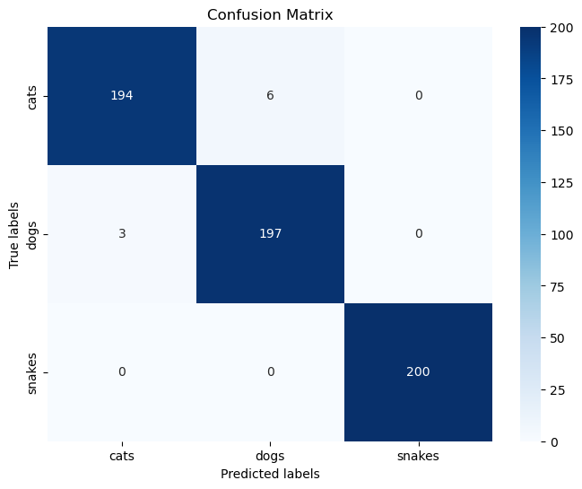

<br/>
<p align="center">
  <h1 align="center">Animal Image Classification with ResNet50</h1>
  <p align="center">
    A deep learning project that classifies animal images using transfer learning with a user-friendly interface.
    <br />
  </p>
</p>

<!-- TECHNOLOGY BADGES -->
<p align="center">
  
  
  
  
  
  
</p>

<p align="center">
  
</p>

### **Introduction**

This project presents an animal image classification system that leverages the power of **transfer learning** with the **ResNet50 architecture**, pre-trained on the extensive ImageNet dataset. The system is designed to accurately distinguish between three distinct classes of animals—**cats, dogs, and snakes**—and achieves a high accuracy of approximately **98.67%** on a balanced test dataset of 600 images.

The methodology encompasses data preprocessing, model fine-tuning, and the implementation of data augmentation techniques to enhance generalization and prevent overfitting. To make the model accessible and interactive, the system features a user-friendly **Graphical User Interface (GUI)** built with **Tkinter**. This interface allows users to easily upload images and receive real-time classification predictions along with confidence scores, bridging the gap between complex deep learning models and practical, user-friendly applications.

This project not only demonstrates the efficacy of transfer learning for image classification tasks but also highlights its potential in various applications, from educational tools to wildlife conservation.

### **Table of Contents**

1.  [Key Features](#key-features)
2.  [Technology Stack](#technology-stack)
3.  [Methodology Overview](#methodology-overview)
4.  [Results & Performance](#results--performance)
5.  [Application Showcase](#application-showcase)
6.  [Getting Started](#getting-started)
7.  [Usage](#usage)
8.  [Future Work](#future-work)
9.  [Contact](#contact)

---

### **Key Features**

-   **High-Accuracy Classification:** Utilizes the ResNet50 model, pre-trained on ImageNet and fine-tuned on a custom dataset, to achieve a classification accuracy of **98.67%**.
-   **Interactive GUI:** A custom-built graphical interface using Tkinter provides an intuitive way for users to interact with the model. Users can select an image from their local files and instantly see the predicted class and the model's confidence probability.
-   **Enhanced Generalization:** Employs a comprehensive set of data augmentation techniques—including rotation, scaling, shifting, shearing, and flipping—to create a robust model that generalizes well to new, unseen images.
-   **Balanced Dataset:** Trained and evaluated on a carefully curated dataset of 3,000 images, with 1,000 images per class (cats, dogs, snakes), ensuring unbiased learning.
-   **Real-Time Prediction:** The system performs classification in real-time, providing immediate feedback upon image selection.

---

### **Technology Stack**

The project is built entirely in Python, leveraging a suite of powerful libraries for deep learning, data manipulation, and GUI development.

#### **Deep Learning & Core Libraries**

-   **TensorFlow & Keras:** The primary framework for building, training, and evaluating the deep learning model. Keras provides the high-level API for defining the model architecture, while TensorFlow powers the backend operations.
-   **Scikit-learn:** Used for splitting the dataset into training, validation, and testing sets, and for generating detailed performance metrics like the classification report and confusion matrix.
-   **NumPy:** Essential for efficient numerical operations and handling the multi-dimensional arrays that represent image data.
-   **Pillow (PIL):** Used for image manipulation tasks, such as opening, resizing, and preparing images for the GUI and model prediction.

#### **Data Visualization & User Interface**

-   **Tkinter:** Python's standard GUI toolkit, used to build the interactive and user-friendly desktop application for real-time classification.
-   **Matplotlib & Seaborn:** Used in the development notebook to visualize the model's training history (accuracy and loss curves) and to plot a clean, annotated confusion matrix.

---

### **Methodology Overview**

The project followed a systematic workflow from data preparation to application development:

1.  **Data Collection & Preprocessing:** A dataset of 3,000 images (1,000 each for cats, dogs, and snakes) was collected. All images were standardized by resizing them to 256x256 pixels. The dataset was then split into training (70%), validation (10%), and testing (20%) sets.
2.  **Model Architecture:** The ResNet50 model, with its weights pre-trained on ImageNet, was used as the base. The final, top classification layer was removed and replaced with a custom head consisting of a Global Average Pooling (GAP) layer followed by a Dense layer with a softmax activation function for our three classes.
3.  **Data Augmentation:** To prevent overfitting and improve the model's ability to generalize, the `ImageDataGenerator` was used to apply real-time augmentations to the training data, including random rotations, shifts, shears, zooms, and horizontal flips.
4.  **Training & Fine-Tuning:** The model was compiled with the Adam optimizer and categorical cross-entropy loss function. It was trained for 10 epochs with early stopping implemented to prevent overfitting by monitoring validation loss.
5.  **Evaluation:** After training, the model's performance was rigorously evaluated on the unseen test set to generate the final accuracy, classification report, and confusion matrix.

---

### **Results & Performance**

The model achieved an outstanding accuracy of **98.67%** on the test dataset, demonstrating its effectiveness in correctly classifying new images.

#### **Classification Report**

The detailed report shows excellent precision, recall, and F1-scores across all three classes, with the 'snakes' class achieving perfect scores.

| Class  | Precision | Recall | F1-Score | Support |
| :----- | :-------: | :----: | :------: | :-----: |
| Cats   |   0.98    |  0.97  |   0.98   |   200   |
| Dogs   |   0.97    |  0.98  |   0.98   |   200   |
| Snakes |   1.00    |  1.00  |   1.00   |   200   |
| **Avg/Total** | **0.99**  | **0.98** | **0.98** | **600** |

#### **Confusion Matrix**

The confusion matrix provides a visual representation of the model's predictions. The strong diagonal indicates a very low number of misclassifications, with only a few instances of confusion between cats and dogs.

<p align="center">
  
</p>

---

### **Application Showcase**

The Tkinter GUI provides a simple and intuitive platform for real-time classification. Below are examples of the classifier correctly identifying different animals with high confidence.

| Correctly Classified Cat                                     | Correctly Classified Dog                                     | Correctly Classified Snake                                     |
| :----------------------------------------------------------- | :----------------------------------------------------------- | :------------------------------------------------------------- |
|  |  |  |

---

### **Getting Started**

Follow these instructions to get a local copy of the project up and running on your machine.

#### **Prerequisites**

-   Python 3.8 or newer
-   pip (Python package installer)

#### **Installation**

1.  **Clone the repository:**
    ```sh
    git clone https://github.com/AlvaroVasquezAI/Animal_Image_Classification.git
    ```

2.  **Navigate to the project directory:**
    ```sh
    cd Animal_Image_Classification
    ```

3.  **Create and activate a virtual environment (recommended):**
    ```sh
    python -m venv venv
    # On Windows
    .\venv\Scripts\activate
    # On macOS/Linux
    source venv/bin/activate
    ```

4.  **Install the required dependencies:**
    A `requirements.txt` file is included for easy setup.
    ```sh
    pip install -r requirements.txt
    ```
    *This will install TensorFlow, NumPy, Scikit-learn, Pillow, and other necessary libraries.*

5.  **Ensure the model file is in the correct location:**
    The trained model, `animal_classifier.keras`, must be located inside a `Program/` directory at the root of the project, as specified in `main.py`. The expected structure is:
    ```
    Animal_Image_Classification/
    ├── main.py
    ├── Program/
    │   └── animal_classifier.keras
    └── ... (other files)
    ```


---

### **Usage**

To run the classifier with the GUI, execute the `main.py` script, which is located inside the `Program` folder. Run the following command from the **root directory** of the project:

```sh
python Program/main.py
```
This will launch the Tkinter application window. Simply click the **"Select Animal"** button to open a file dialog, choose an image, and the model will display its prediction and confidence score.

---

### **Future Work**

-   **Expand the Dataset:** Include more animal classes to create a more comprehensive classifier.
-   **Explore Advanced Models:** Experiment with more recent and powerful architectures like EfficientNet or Vision Transformers to potentially improve accuracy further.
-   **Web Application Deployment:** Deploy the model as a web application using a framework like Flask or FastAPI to make it accessible to a wider audience without requiring a local setup.
