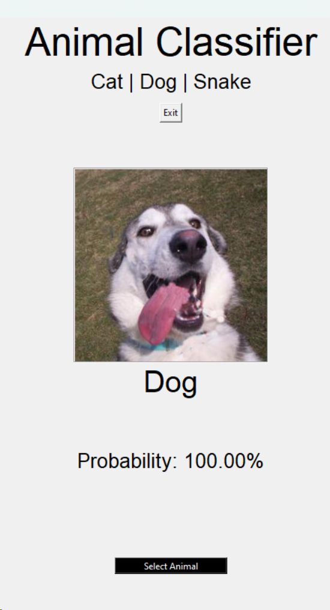
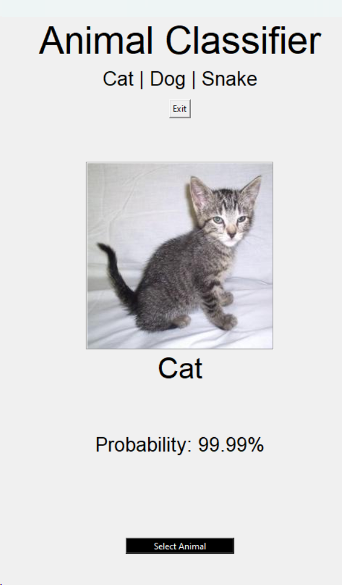
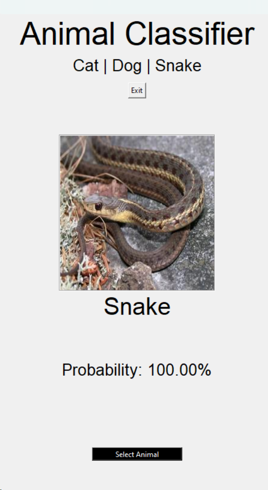

# Animal image classification using transfer learning with ResNet50

This project develops an animal image classification system leveraging the ResNet50 model pre-trained on ImageNet. The classifier distinguishes among three animal categories: cats, dogs, and snakes, with a demonstrated high accuracy on a balanced dataset.

## Features

- Utilizes the ResNet50 model pre-trained on ImageNet for high accuracy.
- Classifies images into three categories: cats, dogs, and snakes.
- Includes a custom-built GUI using Tkinter for interactive classification.
- Employs data augmentation techniques to enhance model generalization.

## Installation

1. Clone the repository:
git clone https://github.com/AlvaroVasquezAI/Animal_image_classification.git

2. Navigate to the project directory:

3. Install the required dependencies:
pip install -r requirements.txt

## Usage

To run the classifier with the GUI, execute (Make sure you are in the correct directory):
python main.py

Follow the GUI prompts to select and classify images.

## Dataset

The dataset consists of 3,000 images, evenly distributed among the three categories. Images were resized to 256x256 pixels to facilitate processing.

## Methodology

The project follows a systematic approach:
1. Data preprocessing and augmentation to prepare the dataset.
2. Loading and fine-tuning the ResNet50 model.
3. Training the model and evaluating its performance.
4. Developing a Tkinter-based GUI for real-time classification.

## Results

The model achieved an accuracy of approximately 98.67% on the test dataset, showcasing the effectiveness of transfer learning in image classification.

Predictions:

## Future Work

- Expand the dataset to include more animal classes.
- Explore advanced deep learning models to enhance classification accuracy.
- Develop a web or mobile application to increase accessibility.

## Contributors

- Álvaro García Vásquez

## Contact

- [Email](mailto:agarciav2102@alumno.ipn.mx)
- [LinkedIn](https://www.linkedin.com/in/álvaro-garcía-vásquez-8a2a001bb/)
- [GitHub](https://github.com/AlvaroVasquezAI)
